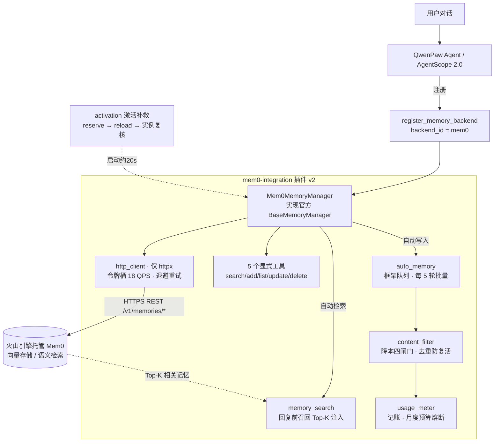

# 🧠 QwenPaw-Mem0：为 QwenPaw 2.x 接入火山引擎 Mem0 的官方记忆后端

### An Official Memory-Backend Plugin Integrating Volcengine Mem0 into QwenPaw 2.x / AgentScope 2.0


> 为开源桌面 Agent [QwenPaw](https://github.com/agentscope-ai/qwenpaw)（底层框架 **AgentScope**）实现其**官方记忆后端接口** `BaseMemoryManager`，把云端托管的[火山引擎 Mem0](https://www.volcengine.com/product/mem0) 接入为一个可按 Agent 独立开关的长期记忆后端：回复前自动语义召回、按节奏批量抽取写入，并提供 5 个显式记忆工具。运行时**仅依赖 `httpx`**（零 mem0ai / 零 Web 框架），内置令牌桶限流、写入降本四道闸门、月度预算熔断、加载时序激活补救与备份恢复。

**关键词**：LLM Agent · 长期记忆 · QwenPaw `register_memory_backend` · AgentScope `BaseMemoryManager` · Mem0 REST · 降本与预算熔断 · 按 Agent 后端切换（云端 Mem0 / 本地 ReMe）

---

## ✨ 核心特性

- **官方记忆后端，而非旁路注入**：v2 实现 QwenPaw 2.x 官方的 `BaseMemoryManager`，通过 `api.register_memory_backend(backend_id="mem0", ...)` 注册，由框架在回复前自动检索、按间隔批量写入，语义与宿主原生记忆完全一致，不再依赖脆弱的类猴子补丁。
- **按 Agent 独立开关**：在某个 Agent 的 `agent.json` 里把 `running.memory_manager_backend` 设为 `mem0` 即启用云端记忆（计费），其余 Agent 继续使用本地免费的 ReMe，互不影响；附带 Windows 一键切换脚本。
- **零第三方记忆 SDK**：用 `httpx` 直连 Mem0 REST，对照官方接口契约独立实现增删改查，规避了冻结 / 精简环境下 `mem0ai` 依赖缺失导致的整体失效；`.env` 解析也只用标准库。
- **自动 + 显式双层记忆**：自动层透明召回 / 批量写入保下限；5 个工具（search / add / list / update / delete）支持关键事实的精准写入、纠错与删除。
- **写入降本四道闸门**：① 每 5 轮批量写，摊薄服务端抽取的固定开销；② 丢弃 tool 角色消息（工具输出不入抽取，最大费用放大器）；③ 噪音 / 长度过滤；④ 内容去重 + 删除防复活。
- **预算熔断**：内置用量记账，按月估算 Credit 与金额，超过月度预算（默认 10 元）**只停写、不停检索**（读远比写便宜）。
- **加载时序激活补救**：针对 QwenPaw 2.x「Agent 工作区先于插件启动」导致首次回退本地后端的问题，注册后自动执行 `reserve_selection → reload_agent → 实例复核`，约 20 秒内零停机激活。
- **备份与恢复**：插件自动同步到 default 工作区的 `_mem0_backup/`，宿主升级 / 换机不丢部署；全程异常兜底，绝不影响 QwenPaw 正常启动。

---

## 🧩 背景：为什么从 v1 重构到 v2

v1 通过 AgentScope 的类级生命周期 Hook（`register_class_hook`）+ Skill 工具实现双层记忆，并在生产环境长期运行。**agentscope 2.0.7 移除了 `register_class_hook`、`agentscope.memory` 与 `_MemoryMark`，v1 的整条注入路径随之失效。**

QwenPaw 2.x 同时给出了官方答案：开放统一的记忆后端抽象 `BaseMemoryManager` 与注册接口 `register_memory_backend`。v2 据此做了一次**彻底重构而非打补丁**，语义与 v1 一一对应：

| v1（agentscope 1.x，已失效） | v2（本仓库，QwenPaw 2.x 官方后端） |
| --- | --- |
| `pre_reply` / `post_reply` 类钩子 | 框架基类 `auto_memory_search()` / `auto_memory()` |
| 5 个 Skill 工具 | `list_memory_tools()` 返回的 5 个记忆工具 |
| 自建异步队列 + worker | 框架 `submit_auto_memory` 共享队列 |
| `mem0ai` SDK + 可选 FastAPI 服务 | `httpx` 直连 REST（零 mem0ai / 零 Web 框架） |
| 进程内猴子补丁注入 | 官方 `register_memory_backend` 注册 |

迁移细节与文件对照见 [CHANGELOG.md](CHANGELOG.md)。

---

## 🏗️ 架构设计



### 自动记忆层（对用户透明）

- **检索**：框架在回复前调用基类 `auto_memory_search()` → 本后端 `memory_search()`，以当前用户消息做语义检索，命中的长期记忆被包装成合成工具消息注入上下文；无结果返回框架约定的 `No relevant memories found.`，默认召回 3 条（`MEM0_MAX_RESULTS`）。
- **写入**：框架把对话放入 `submit_auto_memory` 共享队列，按 `get_auto_memory_interval()`（默认每 5 轮用户回复）回调 `auto_memory()`，批量抽取后写入，摊薄服务端每次抽取的固定提示词开销。
- **隔离**：以 `agent_id` 作为 Mem0 的 `user_id`，不同 Agent 的记忆物理隔离、不串扰。

### 显式工具层（5 个，随后端注册）

| 工具 | 能力 |
| --- | --- |
| `search_memory(query, limit=5)` | 语义检索历史记忆（返回 id 与相似度） |
| `add_memory(content, tags="")` | 显式写入一条关键事实 / 偏好（不依赖自动抽取） |
| `list_memories(limit=20)` | 列出当前 Agent 的记忆（拿到 id 后可改 / 删） |
| `update_memory(memory_id, content)` | 修改一条记忆 |
| `delete_memory(memory_id)` | 删除记忆，并把内容加入去重黑名单防止异步写入使其复活 |

### 写入降本四道闸门

1. **批量节奏**：默认每 5 轮才触发一次服务端抽取写入（`MEM0_AUTO_MEMORY_INTERVAL`，设 0 关闭自动写）。
2. **丢弃工具输出**：默认不把 `tool` 角色消息（浏览器 / 代码执行等动辄数万字符的结果）送入抽取 LLM——这是最大的费用放大器（`MEM0_KEEP_TOOL_MESSAGES`）。
3. **噪音 / 长度过滤**：低于 `MEM0_MIN_WRITE_LENGTH`（默认 10 字）的整段、寒暄、报错堆栈回显、心跳消息一律跳过，同时避免误杀「我喜欢吃蔬菜」这类短事实。
4. **去重与防复活**：`DedupCache` 对同一内容在 TTL（默认 900s）内只写一次；删除记忆时 `mark_deleted` 拉黑，防止队列里排队的写入把已删内容「复活」。

### 预算熔断与限流

- 火山引擎 Mem0 自 **2026-11-02 10:00（UTC+8）** 起计费：Credit 1.12 元 / 百万 Credit，存储 0.0025 元 / 万条·小时。
- 插件按字符数估算 token（约 字符 / 1.6）与 Credit（约 token × 3.2），按月分桶写入本地 `usage.json`；超过 `MEM0_MONTHLY_BUDGET_YUAN`（默认 10 元）后仅暂停写入，检索照常。
- 估算仅用于趋势判断与防意外，**不替代火山控制台账单**；建议首个计费月后按真实账单校准系数。
- 客户端令牌桶默认 18 QPS（低于火山硬限 20），对 429 做指数退避重试（最多 3 次）。

### 加载时序激活补救

QwenPaw 2.x 的实际启动顺序是「Agent 工作区启动 → 插件 `register_memory_backend`」，而注册接口要求在工作区启动前完成，因此配置为 mem0 的 Agent 首次会回退到本地 ReMe。插件在注册后（启动约 20 秒、带 6 次重试）依次执行：

1. `memory_registry.reserve_selection("mem0", agent_id)`：登记预留；
2. `MultiAgentManager.reload_agent(agent_id)`：零停机重建工作区（该接口实为协程，须在事件循环中 `await`）；
3. 通过 GC 以 `isinstance` 复核 `Mem0MemoryManager` 真实实例存在（不能用实例级 `hasattr`，宿主代理对象的万能 `__getattr__` 会造成大量假阳性）。

---

## 📁 目录结构

```
mem0-integration/
├── backend.py                  # 插件入口：注册记忆后端 + restore/backup/shutdown/activate 钩子
├── plugin.json                 # 插件清单（v2.0.0，入口 backend.py）
├── set_mem0_agent.ps1          # 按 Agent 切换 mem0 / remelight 的辅助脚本（Windows）
├── requirements.txt            # 运行依赖（仅 httpx）
├── docs/
│   ├── user-guide-zh.md        # 完整使用说明书（在线版，推荐先读）
│   └── 用户使用说明书.docx      # 同内容 Word 版
└── mem0_service/
    ├── __init__.py
    ├── config.py               # .env 解析与配置校验（仅标准库）
    ├── memory_backend.py       # Mem0MemoryManager：实现官方 BaseMemoryManager
    ├── http_client.py          # 零依赖 REST 客户端（httpx，限流 / 重试）
    ├── tools.py                # 5 个显式记忆工具
    ├── content_filter.py       # 写入过滤与去重（降本核心）
    ├── usage_meter.py          # 用量记账与月度预算熔断
    ├── activation.py           # 后端激活补救（加载时序）
    ├── .env.example            # 环境变量模板（真实 .env 不入库）
    └── requirements.txt        # 历史位置，依赖以根目录为准
```

---

## 🚀 快速开始

### 1. 安装到用户级插件目录

```bash
# 用户级目录不会被 QwenPaw 升级覆盖
git clone https://github.com/HawChen/qwenpaw-mem0.git mem0-integration
# 将 mem0-integration 目录移动到 ~/.qwenpaw/plugins/mem0-integration
```

### 2. 配置凭据

```bash
cp mem0_service/.env.example mem0_service/.env
# 编辑 .env，填入火山引擎 Mem0 的 VOLC_MEM0_HOST 与 VOLC_MEM0_API_KEY
```

> 依赖：QwenPaw 自带 Python 环境已内置 `httpx`，通常无需安装；独立环境可执行 `pip install -r requirements.txt`。

### 3. 为指定 Agent 开启云端记忆

```powershell
# 开启（默认后端 mem0）
powershell -ExecutionPolicy Bypass -File set_mem0_agent.ps1 -AgentId default
# 关闭 / 回退本地免费 ReMe
powershell -ExecutionPolicy Bypass -File set_mem0_agent.ps1 -AgentId default -Backend remelight
# 查看各 Agent 当前使用的记忆后端
powershell -ExecutionPolicy Bypass -File set_mem0_agent.ps1 -List
```

脚本只修改对应 Agent `agent.json` 中的 `running.memory_manager_backend` 字段，写入前自动备份、写入后校验 JSON。

### 4. 重启 QwenPaw

插件随启动注册记忆后端，并在约 20 秒后自动重载并激活目标 Agent，**无需手动新建会话**。日志出现 `✓ 激活成功，真实实例: [...]` 即完成。随后可让 Agent 记住一条信息，开启新会话验证自动召回。

---

## 🔧 配置项（环境变量，详见 `mem0_service/.env.example`）

| 变量 | 说明 | 默认 |
| --- | --- | --- |
| `VOLC_MEM0_HOST` | 专属实例接入地址（不带尾斜杠） | 必填，占位 `https://mem0-<your-instance-id>.mem0.volces.com:8000` |
| `VOLC_MEM0_API_KEY` | 火山引擎 Mem0 API Key（仅存本地 `.env`） | 必填 |
| `MEM0_QPS_LIMIT` | 令牌桶限流（不得超过火山硬限 20） | `18` |
| `MEM0_REQUEST_TIMEOUT` / `MEM0_READ_TIMEOUT` | 连接 / 读取超时（秒） | `5` / `15` |
| `MEM0_MEMORY_SEARCH_ENABLED` | 是否开启回复前自动检索 | `true` |
| `MEM0_MAX_RESULTS` | 自动召回条数 | `3` |
| `MEM0_AUTO_MEMORY_INTERVAL` | 每多少轮用户回复批量写一次（`0` 关闭自动写） | `5` |
| `MEM0_MIN_WRITE_LENGTH` | 触发写入的最短内容长度 | `10` |
| `MEM0_KEEP_TOOL_MESSAGES` | 是否保留 tool 角色消息（降本开关，默认丢弃） | `false` |
| `MEM0_BLACKLIST_TTL` | 去重缓存 / 删除防复活黑名单 TTL（秒） | `900` |
| `MEM0_USAGE_ENABLED` | 是否记录用量估算 | `true` |
| `MEM0_MONTHLY_BUDGET_YUAN` | 月度预算（元），超额只停写 | `10` |
| `MEM0_CREDIT_PER_TOKEN` | 每 token 折算 Credit 的经验系数 | `3.2` |
| `MEM0_YUAN_PER_MILLION_CREDIT` | 每百万 Credit 单价（元） | `1.12` |

---

## 🛣️ Roadmap

- [ ] 检索结果相关性阈值过滤，进一步降低无关记忆注入
- [ ] 首个计费月后用火山真实账单校准 token / Credit 换算系数
- [ ] 记忆可观测面板：写入量、召回命中率、预算消耗
- [ ] 在 `http_client` 抽象之上提供本地向量库后端，支持「数据不出厂」私有化部署

---

## 📚 文档

- [**用户使用说明书（在线 Markdown，推荐先读）**](docs/user-guide-zh.md)：原理、安装配置、按 Agent 开关、5 个工具详解、计费降本、验证方法、FAQ 排障与维护清单。
- [用户使用说明书（Word 版）](docs/用户使用说明书.docx)：同内容的可下载 / 打印版本。
- [变更日志](CHANGELOG.md)：v1 → v2 的架构迁移、接口与文件对照、升级步骤。
- 代码内关键模块均带中文 docstring，建议按 `backend.py → memory_backend.py → http_client.py → content_filter.py / usage_meter.py / activation.py` 顺序阅读。

---

## ⚖️ 法律与商标声明

- **原创与许可**：本仓库自有代码为作者原创，以 **MIT License** 发布（见 [LICENSE](LICENSE)）。
- **扩展合规**：插件基于 QwenPaw / AgentScope（均为 Apache-2.0）**官方开放**的记忆后端接口（`BaseMemoryManager`、`register_memory_backend`）与启动 / 关闭钩子扩展点开发，**未复制、修改或再分发其源代码**，属于独立的第三方插件。
- **第三方组件**：运行时仅依赖 `httpx`（BSD-3-Clause）。`http_client` 的 REST 请求 / 响应契约参考火山引擎 Mem0 官方 API 文档及 mem0ai（Apache-2.0）的公开接口约定，为独立实现，**不含 mem0ai 的 SDK 源码**。完整归属与许可见 [THIRD_PARTY_NOTICES.md](THIRD_PARTY_NOTICES.md)。
- **非官方声明（No Affiliation）**：本项目为个人非官方项目，与阿里巴巴（QwenPaw / 通义 / AgentScope）、字节跳动（火山引擎 Volcengine）、Mem0 AI 均无隶属、赞助或背书关系；相关名称与商标归各自权利人所有，仅用于说明兼容对象与技术来源，未使用任何官方 Logo。
- **云服务自费与凭据安全**：火山引擎 Mem0 需使用者自行开通并获取本人 API Key（仅保存在本地 `.env`，仓库不含任何可用凭据、专属实例地址或业务数据），调用费用、配额与账号合规由使用者自行承担。
- 代码按「现状（AS IS）」提供，免责声明详见 [THIRD_PARTY_NOTICES.md](THIRD_PARTY_NOTICES.md)。

---

## 🙋 关于作者

**HawChen**，AI Agent 产品经理，聚焦大模型在工业 / 企业服务场景的私有化落地，擅长 RAG、多 Agent 编排与 Agent 记忆 / 约束工程。

- 联系方式：通过 GitHub 与我联系 → [@HawChen](https://github.com/HawChen)，欢迎在本仓库提交 Issue / Discussion。

> 本仓库不包含任何真实密钥、专属实例地址与业务数据；第三方框架与服务的版权、商标归各自权利人所有，许可与归属见 [THIRD_PARTY_NOTICES.md](THIRD_PARTY_NOTICES.md)。
