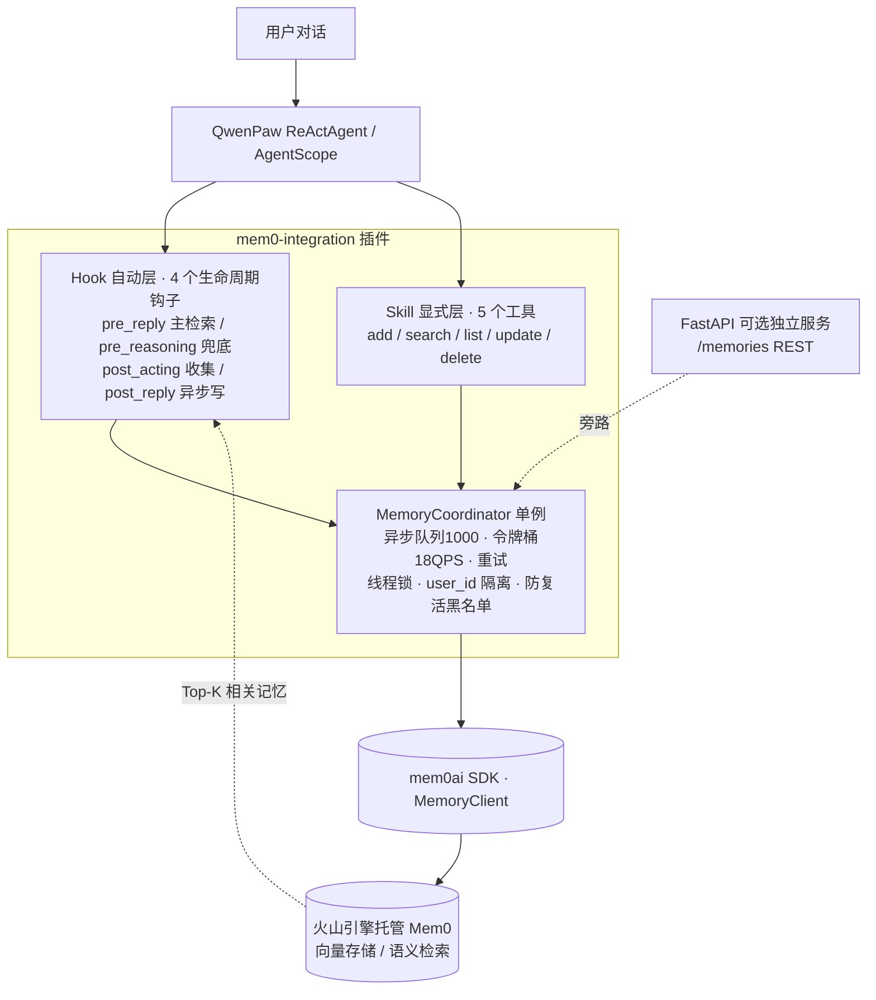

# 🧠 QwenPaw-Mem0：为 Agent 接入「Hook 自动兜底 + Skill 显式增强」双层长期记忆

### Dual-Layer Long-Term Memory for LLM Agents — AgentScope Hooks + Volcengine Mem0


> 为开源桌面 Agent（QwenPaw，底层框架 **AgentScope**）设计的**长期记忆层**：用 4 个生命周期 Hook 实现「回复前自动召回、回复后异步写入」的无感兜底，用 5 个 Skill 工具做关键记忆的显式增删查改；并通过**异步队列、令牌桶限流、线程安全单例、删除防复活、版本兼容探测、备份恢复**保证长期运行的工程可靠性。架构与业务解耦，可平移到任意垂直 Agent。

**关键词**：LLM Agent · 长期记忆 · AgentScope `register_class_hook` · Mem0 向量记忆 · 异步队列 / 令牌桶 · 删除防复活 · 进程内注入 + FastAPI 双模式

---

## ✨ 核心特性

- **双层记忆架构**：Hook 层自动兜底（对用户透明、零配置），Skill 层显式可控（关键事实精准写入/纠错/删除），自动保下限、手动控上限。
- **不阻塞主对话**：`MemoryCoordinator` 用「容量 1000 的异步队列 + 守护线程写入 + 令牌桶限流（默认 18 QPS，低于火山硬限 20）+ 失败重试」，把记忆 I/O 与对话主链路解耦。
- **删除防复活（一致性设计）**：删除/更新记忆时，把原内容及其变体做哈希写入**带 TTL 的黑名单**，异步写入前先过黑名单，避免“队列里还排着写入、用户却已删除”导致记忆复活。
- **面向真实宿主的健壮性**：① 启动时探测 mem0ai / AgentScope / `_MemoryMark.HINT` 等 API，缺失则降级回退而非崩溃；② Agent 类可能晚于插件加载，用后台线程在 60s 内重试注入；③ 插件目录与 workspace `_mem0_backup` 双向同步，宿主升级/换机不丢部署。
- **双运行模式**：主模式为进程内 Hook 注入；另提供可选的 FastAPI 独立服务（`/memories` 增删查改 REST 接口）。
- **托管 vs 自建的选型判断**：非敏感场景用火山引擎托管 Mem0，免自建向量库；客户端层做了抽象，可替换为私有化记忆后端，适配“数据不出厂”场景。

---

## 🧩 背景：为什么做

开源 Agent 长周期使用的三个典型问题：

1. **上下文丢失**：超出上下文窗口或新开会话后，Agent 记不住历史事实与用户偏好；
2. **记忆不可控**：纯自动抽取会漏记错记，缺少人工精准写入与纠错入口；
3. **工程可靠性缺失**：同步写记忆拖慢回复，限流、重试、线程安全、删除一致性等问题在 Demo 阶段常被忽略，长期运行就暴露。

本项目目标不是再写一个聊天 Demo，而是产出一套**可长期稳定运行、可治理、可迁移**的 Agent 记忆层。

---

## 🏗️ 架构设计

### 整体架构



> Gitee 等环境若未渲染 Mermaid，见 `docs/arch.png`（建议导出一张兜底）。

### Hook 自动层（类级别，对所有 Agent 实例生效）

| 钩子 | 注册名 | 触发时机 | 职责 |
| --- | --- | --- | --- |
| `pre_reply` | `mem0_search_inject` | 回复前（主） | 取最后用户消息检索 Top-K 记忆，以 HINT 注入上下文 |
| `pre_reasoning` | `mem0_search_fallback` | 推理前（兜底） | 当 pre_reply 未命中时补一次检索，标志位去重 |
| `post_acting` | `mem0_tool_collect` | 工具执行后 | 把工具结果放入 buffer 累积，供写入时合并 |
| `post_reply` | `mem0_async_write` | 回复后（主写） | 将“用户消息 + 回复 + 工具结果”异步入队 |

### Skill 显式层（5 个工具，注册到 Agent Toolkit）

| 工具函数 | 面向 LLM 的能力 |
| --- | --- |
| `add_memory` | 显式写入关键事实/偏好（不依赖自动抽取） |
| `search_memory` | 语义检索（默认 Top-5，可配上限） |
| `list_all_memories` | 列出当前智能体的全部记忆 |
| `update_memory` | 修改记忆（旧内容自动进防复活黑名单） |
| `delete_memory` | 删除记忆（内容变体一并拉黑） |

### Coordinator 的关键工程设计

- **异步 + 削峰**：`queue.Queue(maxsize=1000)` 缓冲写入峰值，独立 daemon worker 顺序消费，主对话零阻塞；关键信息可用 Skill 同步写入兜底一致性。
- **令牌桶限流**：按配置 QPS 匀速补充令牌、桶容量等于 QPS，保护托管侧不触发 20 QPS 硬限。
- **线程安全单例**：客户端初始化、令牌桶、黑名单分别用锁保护，多 Agent 并发调用安全。
- **智能体隔离**：所有读写带 `user_id`（由 `agent.name` 传入），不同智能体记忆物理隔离、不串扰。
- **防复活**：黑名单 `内容哈希 → 过期时间`，TTL 默认 900s；`blacklist_variants` 在删除/更新时把内容变体一并拉黑，worker 写入前逐条校验。

### 关键设计决策（Design Decisions）

- **为什么 Hook + Skill 双层，而非只做自动记忆？** 自动抽取召回做不到 100% 且不可解释，纯手动又增加负担；双层用自动保下限、手动控上限。
- **为什么写入异步、检索同步？** 写入是最终一致的非关键路径，可异步；召回结果要进当轮上下文，必须同步，故只对写入排队、检索直接执行。
- **为什么需要版本兼容探测？** 宿主与第三方库会升级：启动时先探测 `mem0ai` 版本、AgentScope 是否存在 `register_class_hook`、`_MemoryMark.HINT` 是否可用，任一不满足就降级（如 HINT 不可用回退 system prompt），而不是直接抛错拖垮宿主。
- **为什么用托管 Mem0？** 验证场景数据不敏感，托管省去向量库运维；客户端抽象隔离了后端，切换私有化实现只需替换 `MemoryClient`。

---

## 📁 目录结构

```
mem0-integration/
├── backend.py                     # 插件入口：注册启动/关闭钩子，完成 Hook+Skill 注入、备份恢复
├── plugin.json                    # 插件清单（id/type=hook/入口/版本）
├── test_plugin.py                 # 注入逻辑自测（Path.home 定位，可用 MEM0_PLUGIN_BACKEND 覆盖）
├── docs/                          # 在线使用手册（user-guide-zh.md）+ Word 版说明书
├── requirements.txt               # 依赖说明
└── mem0_service/
    ├── config.py                  # 全部配置读环境变量（.env），含校验与 mem0 客户端配置
    ├── .env.example               # 环境变量模板（真实 .env 不入库）
    ├── test_connection.py         # 连通性自测
    ├── api/routes.py              # 【可选】FastAPI 独立服务：/memories 增删查改
    ├── hooks/memory_hooks.py      # 4 个生命周期 Hook 实现
    ├── skills/memory_skills.py    # 5 个显式记忆工具（ALL_TOOLS）
    ├── utils/coordinator.py       # MemoryCoordinator：队列/限流/黑名单/隔离/单例
    └── qwenpaw_client/mem0_client.py  # mem0ai SDK 封装（托管后端适配层）
```

---

## 🚀 快速开始

### 方式一：作为 QwenPaw 插件（主用法）
```bash
# 1. 克隆后放入宿主用户级插件目录（用户级目录不会被宿主升级覆盖）
git clone https://github.com/【你的用户名】/qwenpaw-mem0.git
# 将目录放到 ~/.qwenpaw/plugins/mem0-integration

# 2. 安装依赖（宿主自带 Python 已预装大部分；独立环境按下表安装）
pip install -r mem0_service/requirements.txt

# 3. 配置凭据（不要把真实 Key 写进代码）
cp mem0_service/.env.example mem0_service/.env
# 编辑 .env，填入 VOLC_MEM0_API_KEY

# 4. 重启 QwenPaw；日志出现“双方案注入完成 / worker thread started”即成功
```

### 方式二：作为独立 FastAPI 服务（可选）
```bash
uvicorn mem0_service.api.routes:app --host 127.0.0.1 --port 8765
# 接口：POST /memories/search、GET /memories、POST /memories、PUT/DELETE /memories/{id}
```

### 连通性 / 注入自测
```bash
python mem0_service/test_connection.py   # 测试到托管 Mem0 的连通
python test_plugin.py                    # 测试 Hook+Skill 是否成功注入 Agent
```

---

## 🔧 配置项（环境变量，详见 `mem0_service/.env.example`）

| 变量 | 说明 | 默认 |
| --- | --- | --- |
| `VOLC_MEM0_API_KEY` | 火山引擎 Mem0 Key（必填，仅存于本地 `.env`） | — |
| `VOLC_MEM0_HOST` | 托管端点（不带尾斜杠） | `https://mem0-cn-beijing.volces.com` |
| `MEM0_SERVICE_HOST/PORT` | 可选 FastAPI 监听 | `127.0.0.1:8765` |
| `MEM0_QPS_LIMIT` | 令牌桶限流（火山硬限 20，保守取 18） | `18` |
| `MEM0_QUEUE_MAX_SIZE` | 异步写入队列容量 | `1000` |
| `MEM0_REQUEST_TIMEOUT / _READ_TIMEOUT` | 写/读超时（秒） | `5 / 3` |
| `MEM0_BLACKLIST_TTL` | 防复活黑名单存活（秒） | `900` |

---

## 📊 效果演示

> 建议录成 GIF 放到 `docs/`：①写入→新会话自动召回；②显式 delete 后验证“不复活”；③两个智能体记忆隔离。

| 场景 | 演示 |
| --- | --- |
| 跨会话自动记忆与召回 | `docs/demo-recall.gif`（待补） |
| 删除后防复活 | `docs/demo-no-revive.gif`（待补） |
| 多智能体记忆隔离 | `docs/demo-isolation.gif`（待补） |

---

## 🛣️ Roadmap

- [ ] 写入前实体抽取去重、检索后相关性阈值过滤，进一步降噪
- [ ] 定时摘要（Auto-dream）把短期事实沉淀为长期画像
- [ ] 抽象记忆后端，提供本地 Milvus 私有化实现
- [ ] 记忆可观测面板：写入量、命中率、队列积压、Token 用量

---

## 📚 文档

- [**用户使用说明书（在线 Markdown，推荐先读）**](docs/user-guide-zh.md)：部署、5 个工具的参数与示例、火山引擎后台查看、7 条 FAQ 排障与日常维护清单
- [用户使用说明书（Word 版）](docs/用户使用说明书.docx)：同内容的可下载 / 打印版本
- 代码内关键模块均带中文 docstring，建议按 `backend.py → hooks/skills → utils/coordinator.py` 顺序阅读。

---

## 🙋 关于作者

AI Agent 产品经理，聚焦大模型在工业 / 企业服务场景的私有化落地，擅长 RAG、多 Agent 编排与 Agent 记忆 / 约束架构。

- 技术博客 / 行业观察：知乎专栏「逆水方塘」【链接待补】
- 联系方式：通过 GitHub 与我联系 → [@HawChen](https://github.com/HawChen)（欢迎在本仓库提交 Issue / Discussion，或访问我的 GitHub 主页）

> 本仓库为个人架构实践，QwenPaw、AgentScope、mem0ai 等第三方框架与服务版权归原作者所有；仓库不包含任何真实密钥与业务数据。
